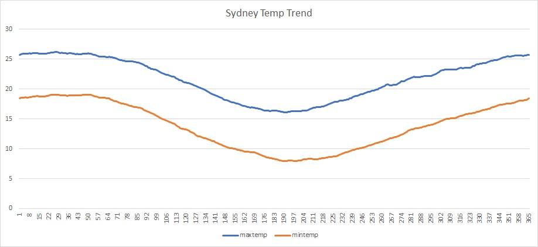
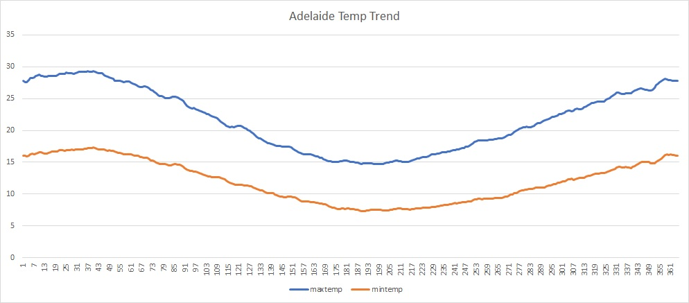

# weather-simulator
Toy wealther simulation will genearte fake data based on study of the real weather data from API.

清晰地模拟天气并输出天气标准格式的数据
Stockholm airport gets a weather simulator

Toy wealther simulation will genearte report data based on study of the real weather data based on input from API.

http://history.openweathermap.org/data/2.5/history/city?id=2147714&type=hour&start=1369728000&end=1369789200

http://history.openweathermap.org/data/2.5/history/city?id={id}&type=hour&start={start}&end={end}

https://samples.openweathermap.org/data/2.5/history/city?id=2147714&type=hour&appid=4de065fa58a4680f5ada222fecc20859

http://www.bom.gov.au/jsp/ncc/cdio/weatherData/av?p_display_type=monthlyZippedDataFile&p_stn_num=066062&p_c=-872833409&p_nccObsCode=36&p_startYear=

http://www.bom.gov.au/climate/data/
| First Header  | Second Header |
| ------------- | ------------- |
| Content Cell  | Content Cell  |
| Content Cell  | Content Cell  |
/***
| Site Name: | Sydney (Observatory Hill) |
| Site_Code: | 066062                    |
| Location:  | -33.86, 151.2             |
***/

| Site Name: | Melbourne (Essendon Airport) |
| Site_Code: | 086038                       |
| Location:  | -37.73, 144.91               |

| Site Name: | Adelaide (West Terrace / Ngayirdapira) |
| Site_Code: | 023000                    |
| Location:  | -34.93, 138.58             |

