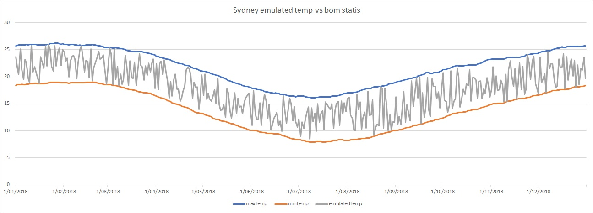
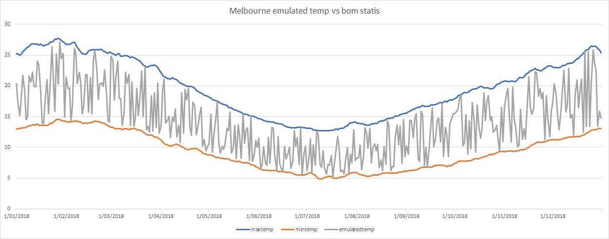
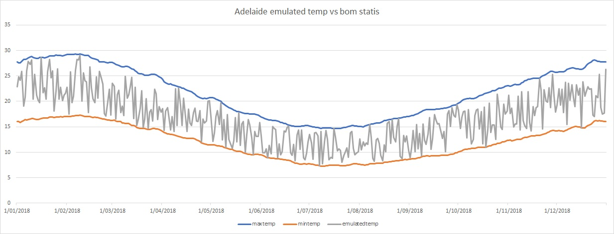
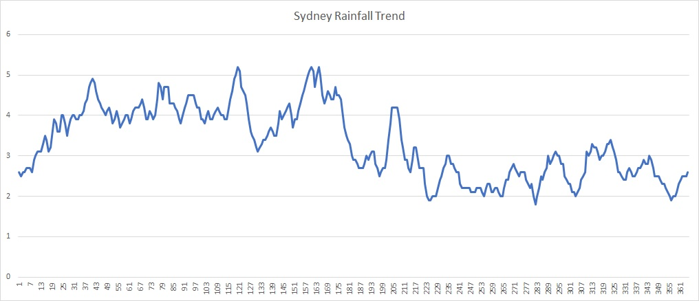
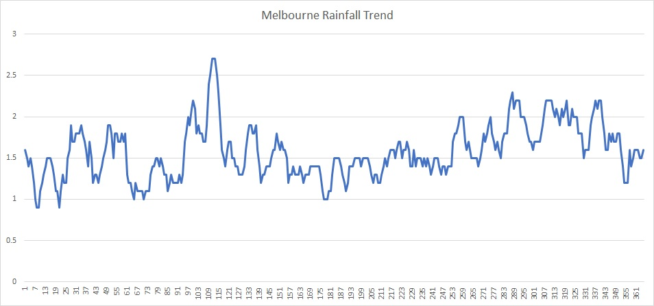
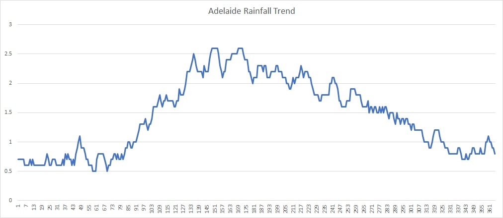

# Weather-Simulator
Toy weather simulation will generate fake weather data based on the real statistical weather data from Bureau of Meteorology website.
http://www.bom.gov.au/climate/data/


## Observation Points
Choose 3 observation points(1 for Sydney, 1 for Melbourne, 1 for Adelaide)

http://www.bom.gov.au/jsp/ncc/cdio/calendar/climate-calendar?stn_num=066062&month=03&day=30
 <table class="tg">
  <tr>
    <th class="tg-yw4l"><b>Site Name:</b></th>
    <th class="tg-yw4l">Sydney (Observatory Hill)</th>
  </tr>
  <tr>
    <th class="tg-yw4l"><b>Site Code:</b></th>
    <th class="tg-yw4l">066062</th>
  </tr>
  <tr>
    <th class="tg-yw4l"><b>Geographic Location:</b></th>
    <th class="tg-yw4l">-33.86, 151.2</th>
  </tr>
  <tr>
    <th class="tg-yw4l"><b>Elevation:</b></th>
    <th class="tg-yw4l">39</th>
  </tr>
</table>

http://www.bom.gov.au/jsp/ncc/cdio/calendar/climate-calendar?stn_num=086038&month=03&day=30
<table class="tg">
  <tr>
    <th class="tg-yw4l"><b>Site Name:</b></th>
    <th class="tg-yw4l">Melbourne (Essendon Airport)</th>
  </tr>
  <tr>
    <th class="tg-yw4l"><b>Site Code:</b></th>
    <th class="tg-yw4l">086038</th>
  </tr>
  <tr>
    <th class="tg-yw4l"><b>Geographic Location:</b></th>
    <th class="tg-yw4l">-37.73, 144.91</th>
  </tr>
  <tr>
    <th class="tg-yw4l"><b>Elevation:</b></th>
    <th class="tg-yw4l">78</th>
  </tr>
</table>

http://www.bom.gov.au/jsp/ncc/cdio/calendar/climate-calendar?stn_num=023000&month=03&day=30
<table class="tg">
  <tr>
    <th class="tg-yw4l"><b>Site Name:</b></th>
    <th class="tg-yw4l">Adelaide (West Terrace / Ngayirdapira)</th>
  </tr>
  <tr>
    <th class="tg-yw4l"><b>Site Code:</b></th>
    <th class="tg-yw4l">023000</th>
  </tr>
  <tr>
    <th class="tg-yw4l"><b>Geographic Location:</b></th>
    <th class="tg-yw4l">-34.93, 138.58</th>
  </tr>
  <tr>
    <th class="tg-yw4l"><b>Elevation:</b></th>
    <th class="tg-yw4l">29</th>
  </tr>
</table>


## Simulator Design, Logic And Sample Data

```
Ps. Not encourage for using UDFs in real work unless there is no other options.
    To make emulation weather design clear and consist, therefore, adopt UDFs. 
```
Bom(Bureau of Meteorology) website has the daily max, min temperature statis from history observation data.
Therefore, the emulated day temperature must be in that range.

```
Weather-sumulator workflow: 
 1. Extract the weather statistics daily data within range of the emulate date
 2. Using Spark SQL + UDFs to generate the emulated data for the same day from specific observation locations.
 3. Genearate verification output by list statistic daily maximum, mininum temperature and emulated temperature in same row.
 4. Virtulize the output using excel
```

Emulated data output under path: `"src/main/resources/emulatedData"`

Output file Header & format: (Location, Position, Local Time, Conditions, Temperature, Pressure, Humidity):
```
Sydney|-33.86,151.2,39|2018-01-01T01:09:51Z|Sunny|+23.8|963.2|75
Sydney|-33.86,151.2,39|2018-01-02T10:37:30Z|Sunny|+24.8|899.5|30
Sydney|-33.86,151.2,39|2018-01-03T12:42:36Z|Sunny|+25.4|864.6|4
Sydney|-33.86,151.2,39|2018-01-04T12:39:04Z|Sunny|+23.6|1036.3|68
Sydney|-33.86,151.2,39|2018-01-05T06:46:52Z|Sunny|+25.2|901.1|84
```

Emulate logic for rest fields -> Local Time, Conditions, Pressure, Humidity
```
Local Time 
 1. follows pattern "yyyy-MM-dd'T'HH:mm:ss'Z'" 
 2. time zone depends on location -> "Australia/Sydney" "Australia/Melbourne" "Australia/Adelaide"
 
Conditions
 1. Temperature lower than 8 degree and humidity between 45-50 -> Snow
 2. humidity larger than 88 -> Rain
 3. Rest -> Sunny
 
 Pressure
  Random value between 800 to 1100 Hpa
 
 Humidity
  Random value between 1 to 100 %
  
```


## Visualized Output Data

Sample emulate date range from 2018-01-01 to 2018-12-31 for Sydney, Melbourne, Adelaide.
We can see the overall temperature(gray line) drops between real statistical max(blue line) and min temperature(orange line).

Sydney: 


Melbourne:


Adelaide:



## Project structure 

Enter main class: `au.com.weather_simulator.Run`

Bom statistical data from website: `"src/main/resources/bomstatis/"`

Emulated data output path: `"src/main/resources/emulatedData"`

Verification data output path: `"src/main/resources/verify"`

Testing input data path: `"src/test/resources/readCSVInput1"`

Testing output data path: `"src/test/resources/writeCSVOutput"`

## Appendix

Ps. rain fall is not part of this simulation. Following Rain fall trend drawn from bom history statistic of whole year.





## License

The MIT License (MIT) - see [`LICENSE.md`](https://github.com/fatih/color/blob/master/LICENSE.md) for more details

 
